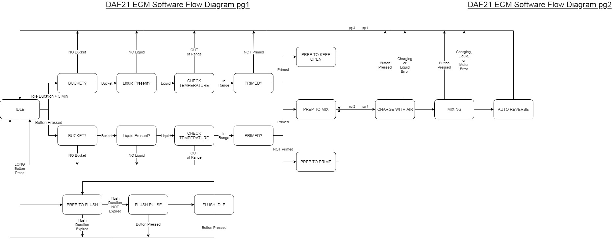

## DAF21 ECM Software Specification ##

This document covers the intended operation of the DAF21 ECM software.

### TABLE OF CONTENTS ###

1. Overview
2. High Level Feature Specifications
	1. Manager
	9. App Interface (Settings)
	2. Status LED
	7. Charger (Air Pressure in Supply Buckets)
	4. Liquid Sensor
	5. Bucket Sensor
	6. Temperature Sensor
	8. Pressure Sensor
3. Feature Implementation Details

### Modules ###

#### App ####
The app for user updating of the ECM runs on top of the Chrome Browser. Details for installing the app can be found in the main readme.

###### App Settings #######

| Name                        | Description                                                                                                                                                                                        | Unit        |
|-----------------------------|----------------------------------------------------------------------------------------------------------------------------------------------------------------------------------------------------|-------------|
| Ratio - Resin               | The portion of the mixed output that will be Resin.                                                                                                                                                | N/A         |
| Ratio - Hardener            | The portion of the mixed output that will be Hardener                                                                                                                                              | N/A         |
| Flow Rate                   | The output speed of the mixed epoxy.                                                                                                                                                               | ml/min      |
| Volume                      | The total volume of mixed epoxy per bolus (button press)                                                                                                                                           | ml          |
| Low Pressure                | The pressure at which the air pump will be begin charging the supply reservoir                                                                                                                     | milli-inH2O |
| High Pressure               | The pressure at which the air pump will cease charging the supply reservoir                                                                                                                        | milli-inH2O |
| Max Charge Time             | The maximum amount of time the air pumps are allowed to attempt to charge the supply reservoir                                                                                                     | ms          |
| Delay after/before Charging | The amount of time between the mixing pumps pausing and the air pump starting and the amount of time between the air pump stopping and the mixing pumps starting                                   | ms          |
| Charging Error Time         | The amount of time the supply buckets are allowed to be under the Low Pressure setting before the ECM determines there is an error. Errors are only checked while the pumps are running.           |             |
| Prime Volume                | The total volume of mixed epoxy during each prime cycle.  Use this number along with "Flow Rate" setting to calculate a time for priming.                                                          | ml          |
| Number of Prime Cycles      | The number of times the ECM must be primed prior to mixing. Each prime cycle is initiated by a button press. Usually 1.                                                                            | N/A         |
| Keep Open Volume            | The total volume of mixed epoxy for each "Keep Open" cycle. Keep Open cycles occur every 5 minutes if the ECM has not otherwise mixed. Keep Open will not run until after the ECM has been primed. | ml          |
| Pail Threshold              | The unitless number representing the minimum value for which the pail sensor determines an output pail is in position.                                                                             | N/A         |
| Auto Reverse Steps          | The number of steps the pumps will reverse travel after a prime, keep open or mix has occured. This number is divided between the Resin and Hardener pumps according to their ratio                | steps       |
| Steps/ml - Resin            | The number of steps required to expel 1ml for the Resin pump.  Used for tuning the volume.                                                                                                         | steps       |
| Steps/ml - Hardener         | The number of steps required to expel 1ml for the Hardener pump.  Used for tuning the volume.                                                                                                      | steps       |

#### Manager ####
The Manager is responsible for the overall state of the ECM.  It controls which state the machine is in according to the below chart.

[Chart Source](https://drive.google.com/file/d/13nGyr6byP3q-WBsoDsLEFW2Cua5BrlQh/view?usp=sharing "Draw.io link")

**Inputs**
- Hardware Pins (Enable, Step, Directions and Assert for each pump)
- Change State - True/False (button, remote or app toggle)
- Start Flush - True/False (long button/remote press)

**Software Outputs**
- Change State Processed - True/False
- Pump Speed - Number (steps/sec)

**Requires Update() Polling**

----------

#### App Interface (Settings)
The App Interface (settings) feature handles the serial communication between the ECM and the App. The app interface processes incoming serial messages and sends responses if required. If a command required the ECM to update any of the user settings, it will update the in-process settings and the stored settings. These settings are retained on power reset.

The following is a list of all commands.  Theses commands are sent via the app and/or serial monitor.

| Command            | Description                                                                                                | Setting            | Returns                        |
|--------------------|------------------------------------------------------------------------------------------------------------|--------------------|--------------------------------|
| action             | Gets the current state of the Manager                                                                      | N/A                | Number (state)                 |
| autoReverseSteps   | Gets or Sets the number of Steps for Auto Reversing                                                        | autoReverseSteps   | Number (steps)                 |
| cloudStatus        | Gets the current state of the Wifi/Cloud Connection                                                        | N/A                | "Connected" or "Not Available" |
| chargeTimeout      | Gets or Sets the max charging time                                                                         | chargeTimeout      | Number (milli-seconds)         |
| chargeCoolDown     | Gets or Sets the minimum charging off time                                                                 | chargeCoolDown     | Number (milli-seconds)         |
| currentPressure    | Gets the current charge pressure                                                                           | N/A                | Number (milli-inH2O)           |
| error              | Gets the current error, if any                                                                             | N/A                | String "none" or error message |
| eepromVersion      | Gets or Sets the curent version of the EEPROM. Not intended to be used for setting.                        | version            | Number                         |
| firmwareID         | Gets the ID of the firmware                                                                                | N/A                | Number                         |
| flowRate           | Gets or Sets the total rate of mixed Resin and Hardener. 1 unique value per selector.                      | flowRate           | Number (milli-liters)          |
| incrementer        | Gets the value of the debug_incrementer. Useful to see if a particular function is being called.           | N/A                | Number                         |
| keepOpenVolume     | Gets or Sets the total volume of resin and hardener                                                        | keepOpenVolume     | Number (milli-liters)          |
| resinPumpSpeed     | Gets the last calculated resin pump speed                                                                  | N/A                | Number (steps/sec)             |
| hardenerPumpSpeed  | Gets the last calculated hardener pump speed                                                               | N/A                | Number (steps/sec)             |
| maxNoPressure      | Gets or Sets the maximum amount of time the supply buckets, pressure can be out of range before an error.  | maxNoPressure      | Number (milli-seconds)         |
| minChargingTime    | Gets or Sets the minimum amount of time the supply buckets should charge before allowing mixing            | minChargingTime    | Number (milli-seconds)         |
| minPrimes          | Gets or Sets the min number of primes before mixing is allowed                                             | N/A                | Number                         |
| name               | Gets the name of the ECM. Only returns name if connected to cloud                                          | N/A                | String "wait" or ECM-name      |
| numSelectors       | Gets the number of selector positions                                                                      | N/A                | Number                         |
| onPressure         | Gets or Sets the pressure for the charging pump to come on                                                 | onPressure         | Number (milli-inH2O)           |
| offPressure        | Gets or Sets the pressure for the charging pump to turn off                                                | offPressure        | Number (milli-inH2O)           |
| pailThreshold      | Gets or Sets the threshold of when the ouput bucket sensor should detect a bucket                          | N/A                | Number                         |
| pailState          | Gets the state of the output bucket sensor                                                                 | N/A                | Number (True/False)            |
| pailRaw            | Gets the raw sensor value of the output bucket sensor. Useful for setting "pailThreshold"                  | N/A                | Number                         |
| primeVolume        | Gets or Sets the combined volume of resin and hardener that mixed in each prime cycle                      | primeVolume        | Number (milli-liters)          |
| primeState         | Gets whether the ECM is primed or unprimed                                                                 | N/A                | Number (True/False)            |
| ratioResin         | Gets or Sets the resin portion of the ratio. 1 unique value per selector.                                  | ratioResin         | Number (ratio * 100)           |
| ratioHardener      | Gets or Sets the hardener portion of the mix ratio. 1 unique value per selector.                           | ratioHardener      | Number (ratio * 100)           |
| selector           | Gets the current position of the selector switch                                                           | N/A                | Number                         |
| startFlush         | Initiates a flush cycle                                                                                    | N/A                | N/A                            |
| stepsPerMlResin    | Gets or Sets the resin pump steps per ml                                                                   | stepsPerMlResin    | Number (steps)                 |
| stepsPerMlHardener | Gets or Sets the hardener pump steps per ml                                                                | stepsPerMlHardener | Number (steps)                 |
| togglePump         | Simulates a button or remote switch short press                                                            | N/A                | N/A                            |
| version            | Gets the FW version of the ECM                                                                             | N/A                | Number                         |
| volume             | Gets of Sets the mixed volume of epoxy. 1 unique value per selector.                                       |                    |                                |
| wifiStatus         | Gets or Sets the whether the ECM should be connected to Wifi/Cloud. Disconnected by default and on restart | N/A                | Number (True/False)            |

----------

#### Status LED #####
Controls the RGB Status LED.  Can change to any color, fast and slow blink or breathing.

| Heirarchy |          Status          |   Color  |     Action     |
|:---------:|:------------------------:|:--------:|:--------------:|
| 1         | SW Update Ready          | Yellow   | Blink Slow     |
| 2         | Error                    | Red      | Blink Fast     |
| 3         | Resin and Hardener Empty | Blue/Red | Alternate Slow |
| 4         | Resin Empty              | Blue     | ON             |
| 5         | Hardener Empty           | Red      | ON             |
| 6         | NO Bucket                | Green    | Blink Fast     |
| 7         | NOT Primed               | Green    | Blink Slow     |
| 8         | Flushing                 | Green    | Breathe        |
| 9         | Default                  | Green    | ON             |

**Inputs**
- Hardware Pins (Red, Green and Blue)

**Software Outputs**
- None

**Requires Update() Polling**

----------

#### Charger (Air Pressure in Supply Buckets) ####

**Inputs**

**Software Outputs**

**Requires Update() Polling**

----------
 

#### Liquid Presence Sensor #####
Detects the presence of liquid in the resin and hardener lines. Interfaces with the Liquid Presence Sensor. There are 2 liquid presence sensors, 1 for each channel (resin, hardener)

**Inputs**
- Hardware Pin (Liquid Sensor)

**Software Outputs**
- Present - True/False

**Requires Update() Polling**

----------

#### Bucket Sensor ####

The Buckets Sensor determines the presence of the output bucket that contains the mixed bolus.
It reads and optical sensor that returns an analog signal indicating the distance of an object (higher = closer). The sensor uses a detection threshold to determine if a bucket is present. If the current reading is over the detection threshold, then a bucket is in position.

**Inputs**
- Hardware Pin (Bucket Sensor)
- Detection Threshold - Number

**Software Outputs**
- Current Reading - Number
- State - True/False

**Requires Update() Polling**

----------

#### Temperature Sensor #####
Measures the temperature of the resin or hardener. Determines if the temperature is within and acceptable range to allow mixing.

**Inputs**
- Hardware Pin (Temperature Sensor)
- Min Temperature - Number (Celsius)
- Max Temperature - Number (Celsius)

**Software Outputs**
- In Range - True/False

**Requires Update() Polling**

----------